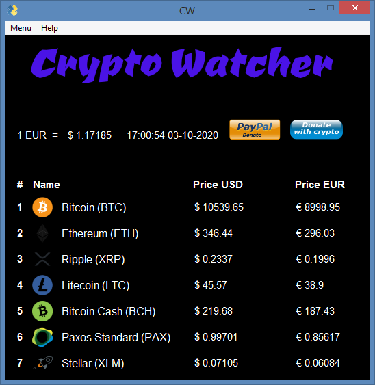
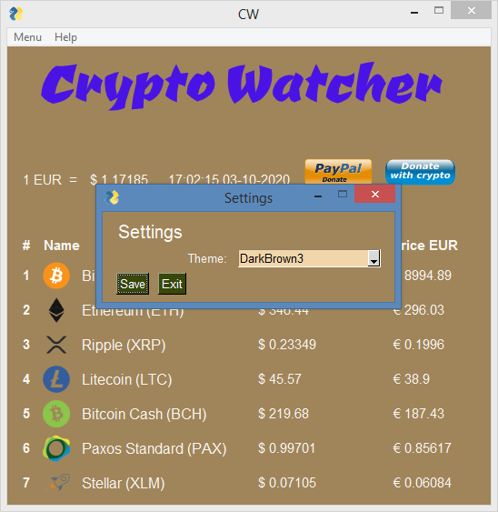
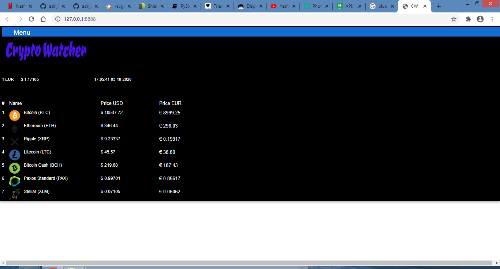

Crypto-watcher is simple program showing price of cryptocurrency in USD and EUR. It's simple to use and everyone can use it.

List of cryptocurrency:

1) Btc - Bitcoin

2) Eth - Ethereum

3) Xrp - Ripple

4) Ltc - Litecoin

5) Bch - Bitcoin cash

6) Pax - Paxos standard

7) Xlm - Stellar

Programed in python with pysimplegui.

How it works:

Program sends requests on Bitstamp API and recive back prices of cryptocurrency's.

How to use:

# Python

pip3 install -r requirements.txt

python3 cw.py

python3 cw-web.py

Added standalone Web App with PySimpleGUIWeb.

