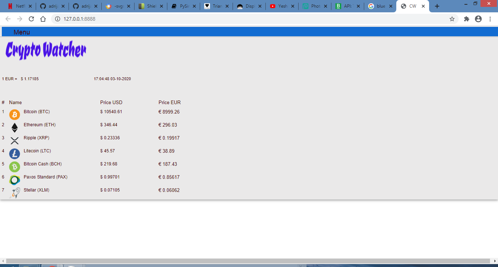

[](https://www.paypal.com/donate/?cmd=_s-xclick&hosted_button_id=PFB6A6HLAQHC2&source=url)

Crypto-watcher is simple program showing price of cryptocurrency in USD and EUR. It's simple to use and everyone can use it.

List of cryptocurrency:
```
1) Btc - Bitcoin

2) Eth - Ethereum

3) Xrp - Ripple

4) Ltc - Litecoin

5) Bch - Bitcoin cash

6) Pax - Paxos standard

7) Xlm - Stellar
```

Programed in Python with PySimpleGUI.

# How it works:
```
Program sends requests on Bitstamp API and recive back real-time prices of Cryptocurrencies.

```
# How to use:

```
Python3+

git clone https://github.com/adrijano/crypto-watcher.git

cd crypto-watcher && pip3 install -r requirements.txt

python3 cw.py

python3 cw-web.py

Added standalone Web App with PySimpleGUIWeb.

Windows:

cd dist

cw.exe
```





